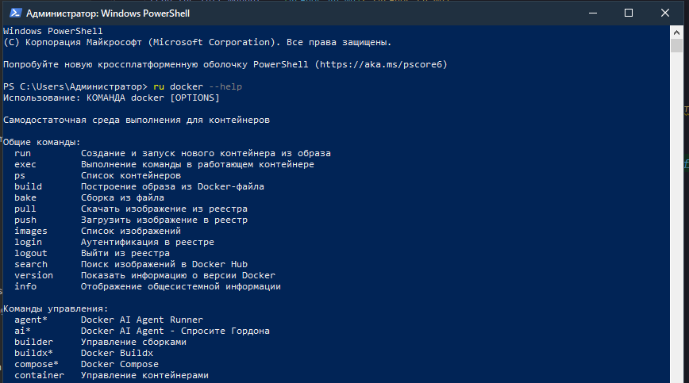

# Zsh-translate

Переводчик текста и вывода команд на русский язык для **zsh** (Linux/macOS) и **PowerShell** (Windows).

Работает через [MyMemory Translation API](https://mymemory.translated.net/). Подходит для конвейеров, скриптов и интерактивного терминала.

[](https://github.com/StudentVik74/Zsh-translate/actions/workflows/test.yml)
[](#тесты)
[](LICENSE)
[](https://www.python.org/downloads/)
[](#установка)




---

## Содержание

- [Возможности](#возможности)
- [Требования](#требования)
- [Установка](#установка)
- [Использование](#использование)
- [Поведение](#поведение)
- [Кэширование](#кэширование)
- [Обработка ошибок](#обработка-ошибок)
- [Настройки](#настройки)
- [Архитектура](#архитектура)
- [Тесты](#тесты)
- [Ограничения](#ограничения)
- [Лицензия](#лицензия)

---

## Возможности

- **Три режима работы** — перевод вывода команды, перевод произвольного текста, чтение из `stdin`.
- **Пакетный перевод (батчинг)** — соседние строки склеиваются в один запрос к API, что ускоряет работу и экономит лимиты.
- **Кэширование** — успешные переводы сохраняются на диск. Повторный перевод — мгновенный, без обращения к API.
- **Умный пропуск строк** — строки с кириллицей, командные строки, stacktrace и пути компилятора не отправляются в переводчик.
- **Help-режим** — при переводе справок (`--help`) имена команд не переводятся, а описания переводятся. Выравнивание колонок сохраняется.
- **Восстановление после ошибок** — если пакетный перевод не удался, строки переводятся по отдельности.
- **Диагностика квоты** — при первой ошибке API выводится предупреждение с уточнением: квота исчерпана или проблема с сетью.

---

## Требования

- **Python** 3.12 или выше
- **Библиотека** `requests`
- Для тестов:  `pytest`

---

## Установка

### Windows (PowerShell)

1. Установите Python 3.12+ с [python.org](https://www.python.org/downloads/). При установке поставьте галочку **«Add Python to PATH»**.

2. Установите `requests`:

   ```powershell
   python -m pip install requests
   ```

3. Создайте папку и скопируйте скрипт:

   ```powershell
   New-Item -ItemType Directory -Path "$HOME\.zsh" -Force
   Copy-Item translate.py "$HOME\.zsh\translate.py"
   ```

4. Разрешите выполнение скриптов (один раз):

   ```powershell
   Set-ExecutionPolicy -ExecutionPolicy RemoteSigned -Scope CurrentUser
   ```

5. Добавьте функцию `ru` в профиль PowerShell. Подробная инструкция с готовым кодом — в [`PowerShell/INSTALL_RU.md`](Scripts/INSTALL_RU.md).

6. Перезапустите PowerShell и проверьте:

   ```powershell
   ru -t "hello"
   ```

### Linux / macOS (zsh)

1. Установите `requests`:

   ```bash
   pip3 install --user --break-system-packages requests
   ```

   На старых системах, где нет защиты PEP 668, достаточно:

   ```bash
   pip3 install --user requests
   ```

2. Создайте папку и скопируйте скрипт:

   ```bash
   mkdir -p ~/.zsh
   cp translate.py ~/.zsh/translate.py
   python3 -m py_compile ~/.zsh/translate.py && echo OK
   ```

3. Добавьте функцию `ru` в `~/.zshrc`:

   ```bash
   nano ~/.zshrc
   ```

   В конец файла вставьте:

   ```zsh
   ru() {
       if [[ $# -eq 0 ]]; then
           if [[ -t 0 ]]; then
               echo "Использование:"
               echo "  ru <команда> [аргументы]   — выполнить команду и перевести вывод"
               echo "  ru -t <текст>              — перевести текст"
               echo "  <команда> | ru             — перевести stdin"
               return 1
           fi
           python3 ~/.zsh/translate.py
           return
       fi

       if [[ "$1" == "-t" || "$1" == "--text" ]]; then
           shift
           if [[ $# -eq 0 ]]; then
               python3 ~/.zsh/translate.py
               return
           fi
           echo "$*" | python3 ~/.zsh/translate.py
           return
       fi

       "$@" 2>&1 | python3 ~/.zsh/translate.py
       return ${pipestatus[1]}
   }
   ```

4. Перезагрузите конфиг:

   ```bash
   source ~/.zshrc
   ```

5. Проверьте:

   ```bash
   ru -t "hello"
   ```

---

## Использование

### 1. Перевод вывода команды

```bash
ru <команда> [аргументы]
```

Команда выполняется, её `stdout` и `stderr` объединяются, переводятся и выводятся на экран. Код возврата — от исходной команды.

Примеры:

```bash
ru docker --help 
ru git status
ru uv --help
```

### 2. Перевод текста

```bash
ru -t "текст"
ru --text "текст"
```

Пример:

```bash
ru -t "You're 52 and decided to start learning programming? You're a legend!"
```

Вывод:

```
Тебе 52 года и ты решил начать учиться программированию? Да ты просто красавчик!
```

### 3. Перевод из stdin (pipe)

```bash
<команда> | ru
```

Примеры:

```bash
echo "Something went wrong" | ru
# → Что-то пошло не так

cat file.txt | ru
# → переведёт содержимое файла
```

### 4. Справка

```bash
ru
```

Показывает три режима и краткое описание.

---

## Поведение

### Что пропускается

Следующие строки **не отправляются в переводчик**:

- Пустые строки и строки из одних пробелов.
- Строки, содержащие кириллицу (текст уже на русском).
- Командные строки (`$ ...`, `# ...`, `> ...`).
- Stacktrace Python (`at ... (...)`), Java (`at com.example.Main(...)`).
- Указания файлов (`File "app.py", line 5`).
- Ошибки компилятора/линковщика (`app.py:15:3: error: ...`).

### Help-строки

Строки вида `  команда    Описание` в выводе `--help` разбираются на две части:

- **prefix** (`  команда    `) — не переводится;
- **body** (`Описание`) — переводится.

Это сохраняет имена команд латиницей и не ломает выравнивание колонок.

---

## Кэширование

- Кэш хранится в `~/.cache/translate_ru/translate_ru.json`.
- На Windows: `%USERPROFILE%\.cache\translate_ru\translate_ru.json`.
- Кэшируются **только успешные** переводы. Fallback (оригинал при ошибке API) в кэш не попадает.
- При повторном запуске строка, найденная в кэше, переводится мгновенно, без обращения к API.

Сбросить кэш:

```bash
rm -f ~/.cache/translate_ru/translate_ru.json
```

```powershell
Remove-Item "$HOME\.cache\translate_ru\translate_ru.json"
```

---

## Обработка ошибок

- При **первой** ошибке API выводится предупреждение в `stderr`. Повторные ошибки в том же запуске не повторяются.
- После предупреждения выполняется проверка квоты MyMemory:
  - **квота исчерпана** — сообщение о том, что перевод не работает до следующего дня (UTC);
  - **квота не исчерпана** — сообщение о вероятной проблеме с сетью или сервером.
- Строки, которые не удалось перевести, остаются без изменений.
- Ошибки чтения/записи кэша не прерывают работу.

---

## Настройки

Переменные в начале файла `translate.py`:

| Переменная       | Описание                             | Значение по умолчанию                       |
|------------------|--------------------------------------|---------------------------------------------|
| `CACHE_FILE`     | Путь к файлу кэша                    | `~/.cache/translate_ru/translate_ru.json`   |
| `LT_URL`         | URL MyMemory API                     | `https://api.mymemory.translated.net/get`   |
| `MYMEMORY_EMAIL` | Email для увеличения дневного лимита | `""` (пусто)                                |
| `MAX_CHUNK`      | Максимальный размер пакета (символы) | `400`                                       |

### Про `MYMEMORY_EMAIL`

По умолчанию MyMemory даёт **5000 символов в день** анонимно. Если указать email — лимит поднимается до **50000 символов в день**. Регистрация не нужна, email просто добавляется в запрос.

```python
MYMEMORY_EMAIL = "your@example.com"
```

---

## Архитектура

### Три режима работы

```
ru <команда>   ─┐
ru -t "текст"  ─┼──►  translate.py  ──►  MyMemory API
<команда> | ru ─┘          │
                           ▼
                     stdout (перевод)
```

### Внутренняя логика

```
stdin
  │
  ▼
process(text, cache)
  │
  ├── should_skip(line) ─────► пропуск строк
  ├── key(body) ─────────────► MD5-хеш для кэша
  ├── load_cache() ──────────► загрузка кэша
  │
  ├── Пакетная обработка:
  │     ├── lt_translate(batch) ──► пакетный запрос
  │     └── lt_translate(line) ───► построчный fallback
  │
  ├── save_cache(cache) ─────► сохранение кэша
  │
  ▼
stdout
```

---

## Тесты

- Запуск всех быстрых тестов (без сети):

  ```bash
  uv run pytest -v
  ```

- С покрытием:

  ```bash
  uv run pytest --cov=utils --cov-report=term-missing
  ```

- Интеграционные тесты (реальный MyMemory API, тратят квоту):

  ```bash
  uv run pytest -m integration -v
  ```

Подробное описание тестов — в [`tests/README.md`](tests/README.md).

---

## Ограничения

- **Только en → ru.** Строки на других языках не переводятся.
- **Лимит MyMemory:** 5000 символов/день анонимно, 50000 с email. Обнуляется раз в сутки (UTC).
- **Приватность:** текст уходит на сервер MyMemory. Не используйте для паролей и секретов.
- **Качество перевода** зависит от контекста. Технические токены (флаги, имена файлов, идентификаторы) могут переводиться как обычные слова.

---

## Лицензия

Распространяется по лицензии [MIT](LICENSE).

Copyright (c) 2026 StudentVik74
