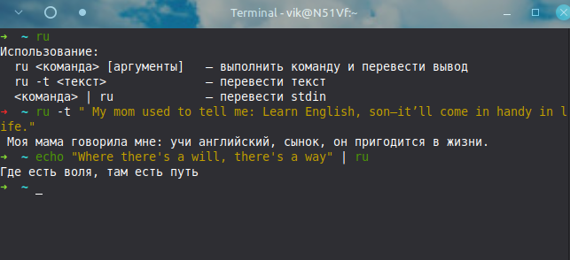

#  Утилита mymemory_translator.py плюс скрипт для терминала Zsh



Утилита для пакетного перевода текста на русский язык через [MyMemory Translation API](https://mymemory.translated.net/) одной зависимостью от библиотеки `requests`.

Работает со стандартным потоком ввода (`stdin`) и выводит переведённый текст в `stdout`. Подходит для интеграции в конвейеры обработки текста (pipelines), скриптов и редакторов.

---
## Возможности

- **Пакетный перевод (батчинг)** — соседние строки склеиваются в один запрос к API, что ускоряет обработку и экономит лимиты.
- **Кэширование** — успешные переводы сохраняются в файл на диске (`~/.cache/translate_ru/translate_ru.json`). Повторный перевод уже переведённых текстов происходит мгновенно.
- **Автоматический пропуск** — строки, уже содержащие кириллицу, или совпадающие с паттернами ошибок/стэктрейсов, пропускаются без отправки в API.
- **Проверка квоты** — при первой ошибке API выводится предупреждение с проверкой доступной квоты.
- **Восстановление** — если пакетный перевод не удался, строки переводятся по отдельности.
---
## Ограничения

- **Только en → ru.** Другие языки не переводятся.
- **Лимит MyMemory:** 5000 символов/день анонимно,
  50000 с email. Обнуляется раз в сутки (UTC).
- **Приватность:** текст уходит на сервер MyMemory.
  Не используй для паролей и секретов.

---

 ## Использование

### Когда нужно перевести справку какой-либо команды,


```bash
ru docker --help 
```
**Выходной текст:**
```
Использование: docker run [параметры] Image [команда] [аргументы]
Создание и запуск нового контейнера из образа
Псевдонимы :
  запуск  docker-контейнера, запуск docker
Oпции:
      --add-host list       Добавте пользовательское сопоставление узла(хоста) с IP (host:ip)
      --другая опция ...    русский текст
      и так далее 

```


### Когда нужно перевести текст быстро не переходя в браузер или какой-либо другой интерактивный интерфейс для перевода

**Команда:**

```bash
ru -t "You're 52 and decided to start learning programming? You're a legend!"
```

**Выходной текст:**
```
Тебе 52 года и ты решил начать учиться программированию? Да ты просто красавчик!

  ```

## Поведение

### Что пропускается

Скрипт автоматически пропускает следующие строки:

- Пустые строки.
- Строки, уже содержащие кириллицу (русский текст).
- Строки, совпадающие с паттернами:
  - Командные строки (`$`, `#`, `>`).
  - Стек-трейсы Python (`at ... (...)`).
  - Указания файлов (`File "..."`).
  - Ошибки компилятора/линковщика (`file.py:line:col:`).

### Кэширование

- Кэш хранится в `~/.cache/translate_ru/translate_ru.json` (на Windows — в `%USERPROFILE%\.cache\translate_ru\translate_ru.json`).
- Кэшируются **только успешные** переводы.
- При повторном запуске текст, уже присутствующий в кэше, переводится мгновенно без обращения к API.

### Пакетная обработка

- Соседние строки склеиваются в пакеты до `MAX_CHUNK = 400` символов.
- Если пакетный перевод не удался (не совпало количество строк), строки переводятся по отдельности.

### Обработка ошибок

- При первой ошибке API выводится предупреждение в `stderr`.
- Выполняется проверка квоты:
  - Если квота исчерпана — выводится соответствующее сообщение.
  - Если квота не исчерпана — вероятно, проблема с сетью или сервером.
- Строки, которые не удалось перевести, остаются без изменений.

## Интеграция с zsh

Чтобы использовать перевод как команду `ru` в терминале zsh, выполните следующие шаги.

### 1. Создать папку и скрипт

```bash
mkdir -p ~/.zsh
nano ~/.zsh/translate.py
```

Вставить код из `mymemory_translator.py` и сохранить: `Ctrl+O`, `Enter`, `Ctrl+X.`

Проверить синтаксис:

```bash
python3 -m py_compile ~/.zsh/translate.py && echo OK
```

### 2. Добавить функцию `ru` в конфиг`~/.zshrc`

```bash
nano ~/.zshrc
или в простом текстовом редакторе откройте и отредактируйте файл.потом сохраните изменения
```

В конец файла добавить:

```zsh
ru() {
    if [[ $# -eq 0 ]]; then
        if [[ -t 0 ]]; then
            echo "Использование:"
            echo "  ru <команда> [аргументы]   — выполнить команду и перевести вывод"
            echo "  ru -t <текст>              — перевести текст"
            echo "  <команда> | ru             — перевести stdin"
            return 1
        fi
        python3 ~/.zsh/translate.py
        return
    fi

    if [[ "$1" == "-t" || "$1" == "--text" ]]; then
        shift
        if [[ $# -eq 0 ]]; then
            python3 ~/.zsh/translate.py
            return
        fi
        echo "$*" | python3 ~/.zsh/translate.py
        return
    fi

    "$@" 2>&1 | python3 ~/.zsh/translate.py
    return ${pipestatus[1]}
}
```

Сохранить, перезагрузить:

```bash
source ~/.zshrc
```

---

## Настройки

Переменные в начале файла `mymemory_translator.py`:

| Переменная       | Описание                             | Значение по умолчанию                     |
|------------------|--------------------------------------|-------------------------------------------|
| `CACHE_FILE`     | Путь к файлу кэша                    | `~/.cache/translate_ru/translate_ru.json` |
| `LT_URL`         | URL MyMemory API                     | `https://api.mymemory.translated.net/get` |
| `MYMEMORY_EMAIL` | Email для увеличения лимита          | `""` (пусто)                              |
| `MAX_CHUNK`      | Максимальный размер пакета (символы) | `400`                                     |

## Архитектура

```
stdin
  │
  ▼
process(text, cache)
  │
  ├── should_skip(line) ────► пропуск строк
  ├── key(body) ────────────► MD5-хеш для кэша
  ├── load_cache() ─────────► загрузка кэша
  │
  ├── Пакетная обработка:
  │     ├── lt_translate(batch) ──► пакетный запрос
  │     └── lt_translate(line) ───► построчный fallback
  │
  ├── save_cache(cache) ──────► сохранение кэша
  │
  ▼
stdout
```

## Ограничения

- MyMemory API — бесплатный сервис с ограничениями.
- Качество перевода может варьироваться в зависимости от контекста и домена текста.
- Для перевода больших объёмов текста рекомендуется указать `MYMEMORY_EMAIL`.

## Лицензия

Распространяется по лицензии MIT ([MIT License](https://opensource.org/licenses/MIT)).

### MIT License — русский перевод

Copyright (c) 2026

Настоящим разрешается любому лицу получать копию
этого программного обеспечения и сопутствующей документации
(далее — «Программное обеспечение») безвозмездно, действовать
в Программном обеспечении без ограничений, включая, но не
ограничиваясь правами на использование, копирование, изменение,
объединение, публикацию, распространение, сублицензирование и/или
продажу копий Программного обеспечения, а также лицам, которым
Предоставляется Программное обеспечение, при соблюдении следующих условий:

Указанное выше уведомление об авторском праве и настоящее уведомление
об условиях использования должны быть включены во все копии
или значимые части Программного обеспечения.

ПРОГРАММНОЕ ОБЕСПЕЧЕНИЕ ПРЕДОСТАВЛЯЕТСЯ «КАК ЕСТЬ», БЕЗ КАКИХ-ЛИБО ГАРАНТИЙ,
ЯВНЫХ ИЛИ ПОДРАЗУМЕВАЕМЫХ, ВКЛЮЧАЯ, НО НЕ ОГРАНИЧИВАЯСЬ ГАРАНТИЯМИ
ТОВАРНОЙ ПРИГОДНОСТИ, СООТВЕТСТВИЯ ПО ЕГО КОНКРЕТНОМУ НАЗНАЧЕНИЮ,
ОТСУТСТВИЯ НАРУШЕНИЙ ПРАВ И ПРИЕМЛЕМОСТИ ДЛЯ КОНКРЕТНОЙ ЦЕЛИ.
НИ В КАКОМ СЛУЧАЕ АВТОРЫ ИЛИ ПРАВООБЛАДАТЕЛИ НЕ НЕСУТ ОТВЕТСТВЕННОСТИ
ПО ИСКАМ О ВОЗМЕЩЕНИИ УЩЕРБА, УБЫТКОВ ИЛИ ДРУГИХ ТРЕБОВАНИЙ
ПО ИСКАМ, ВОЗНИКАЮЩИМ ИЗ ДОГОВОРА, ДЕЛИКТА ИЛИ ИНЫМ ОБСТОЯТЕЛЬСТВАМ,
В КОТОРЫХ МОЖЕТ БЫТЬ ПОДОЗРЕВАЕТСЯ ПРОГРАММНОЕ ОБЕСПЕЧЕНИЕ, ИСПОЛЬЗОВАНИЕ
ИЛИ ИНЫЕ ДЕЙСТВИЯ С ПРОГРАММНЫМ ОБЕСПЕЧЕНИЕМ.
